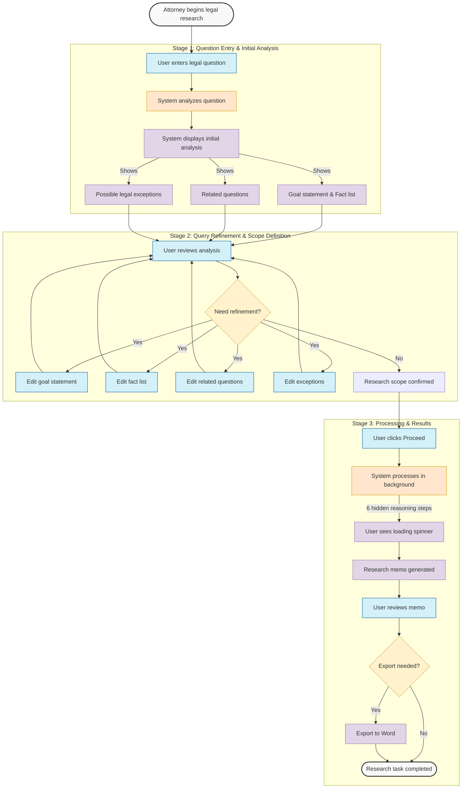

# Deep Research Memo (DRM) App - User Journey

## User Profile
**Primary User:** Licensed Research Attorney
**Context:** Professional legal researchers who need to efficiently find specific answers to complex legal questions with high accuracy. They are time-constrained, detail-oriented, and responsible for providing reliable legal information.

## Journey Overview
The DRM App guides attorneys through a structured process to obtain precise legal answers, from question formulation to receiving a comprehensive research memo.

## Stage 1: Question Entry & Initial Analysis
**User Goal:** Formulate a legal question and get the system to understand it correctly.

**User Actions:**
* Opens the app in their workflow
* Types or pastes a legal question into the input field
* Submits the question for analysis

**System Response:**
* Processes the question and returns:
  - Goal statement (reframed question)
  - Fact list extracted from the question
  - List of related questions
  - List of possible legal exceptions

**User Experience:**
* **Emotions:** Anticipation, slight uncertainty about whether the system will understand their query
* **Pain Points:**
  - Concern about whether their complex question will be properly interpreted
  - Uncertainty about how much detail to include in the initial query
  - Possible frustration if the system takes too long to analyze

## Stage 2: Query Refinement & Scope Definition
**User Goal:** Ensure the system has correctly understood their research question and refine the parameters as needed.

**User Actions:**
* Reviews the system's interpretation of their question
* Assesses the extracted facts for accuracy and relevance
* Evaluates related questions that establish the scope
* Reviews potential legal exceptions that might apply
* Modifies elements by:
  - Deleting irrelevant information (using the delete icon)
  - Editing individual lines in each section
  - Answering clarifying questions (yes/no/unknown)
  - Adding additional context where needed

**User Experience:**
* **Emotions:** Critical assessment, engagement, sense of control
* **Pain Points:**
  - May feel overwhelmed if too many options are presented
  - Might be unsure about the implications of removing certain elements
  - Could be concerned about missing important considerations
  - Potential friction if edit controls aren't intuitive

## Stage 3: Processing & Results
**User Goal:** Obtain a comprehensive and accurate legal memo addressing their question.

**User Actions:**
* After refining the query, clicks "Proceed" to initiate deep research
* Waits while the system processes the request
* Reviews the generated research memo
* Exports the memo to Word if desired

**User Experience:**
* **Emotions:** Anticipation during waiting, relief and satisfaction when receiving clear answers
* **Pain Points:**
  - Potential impatience during processing time (watching the spinner)
  - Concern about comprehensiveness of the results
  - Possible frustration if results don't fully address their question

## Key Differentiator
Unlike competing solutions that provide vague answers and require users to read through numerous cases, DRM delivers clear, specific answers in a ready-to-use research memo format.

## Integration into Workflow
The memo can be exported to Word, allowing attorneys to easily incorporate the findings into their broader legal work, whether for client advice, case preparation, or internal briefings.

## User Value Proposition
DRM saves attorneys significant time by:
1. Eliminating the need to sift through irrelevant cases
2. Providing clear, direct answers to complex legal questions
3. Offering a structured approach to refining legal queries
4. Delivering export-ready memos that can be immediately utilized

# User instruction / how to use this app:

> Enter your legal question in the text field. 
> The system will analyze it and return a goal statement, key facts, related questions, and possible exceptions. 
> Review these sections carefully, adding context, removing irrelevancies, or clarifying details as needed. 
> When you’re satisfied, click Proceed to generate a comprehensive research memo. 
> Finally, review your memo and export it to Word if needed

# PROCESS FLOWCHART

