# User Journey: Demand Letter (DL) App

## User Profile
**Licensed Research Attorney**
- Professional with legal expertise who needs to efficiently prepare demand letters
- May be handling multiple cases simultaneously
- Values accuracy, time efficiency, and professional quality output
- Has legal knowledge but appreciates assistance with research and document preparation

## Journey Overview

### Stage 1: Case Intake
**User Goal:** Begin a new demand letter by entering client information and case details

**User Experience:**
- User accesses the DL App from their workspace, likely during case review
- User initiates a new demand letter project by selecting "New Demand Letter"
- User is presented with options to input client intake information:
  * Copy and paste text directly into the interface from email or some other source
  * Upload a document (doc, pdf, etc.)

**Emotions:** Focused, possibly under time pressure, hoping for a smooth start to the process

**Pain Points:**
- May be working with incomplete or poorly organized client information
- Might have concerns about data security when uploading sensitive client information
- Could be frustrated if document formatting is lost during upload

**Interface Elements:**
- Clear upload area with drag-and-drop functionality
- Text field for direct input
- Document format compatibility indicators
- Progress indicator during upload/processing

### Stage 2: Fact Extraction
**User Goal:** Generate a structured set of case facts from the client intake information

**User Experience:**
- After successful intake upload, user reviews the imported information
- User initiates fact extraction by clicking "Extract Facts" button
- System processes the intake information with visual indication of progress
- Facts are presented in an organized format:
  * Chronological timeline view
  * Categorized fact list (empirical, alleged, contextual, etc.)
- User can review, edit, add, or remove facts as needed

**Emotions:** Hopeful that the system will save time, analytical when reviewing the extracted information, possibly concerned about accuracy

**Pain Points:**
- Frustration if system misses important facts or misclassifies information
- Uncertainty about how comprehensive the extraction is
- Need to verify system work while trying to save time

**Interface Elements:**
- Fact extraction progress indicator
- Toggle between timeline and list views
- Color-coding or icons for different fact types
- Edit controls for refining the fact set
- "Add Fact" functionality for manual additions

### Stage 3: Cause of Action Analysis
**User Goal:** Identify appropriate legal causes of action based on case facts

**User Experience:**
- User initiates cause of action analysis by clicking "Suggest Causes of Action"
- System analyzes facts and presents potential valid claims
- For each suggested cause of action, system shows:
  * Relevance score or confidence level
  * Key supporting facts
  * Brief explanation of why it may apply
- User can select which causes of action to include in the demand letter

**Emotions:** Evaluative, professionally critical, appreciative of valid suggestions, dismissive of irrelevant ones

**Pain Points:**
- Concern about missing viable causes of action
- Need to validate system suggestions against professional knowledge
- Possible tension between efficiency and thoroughness

**Interface Elements:**
- List of suggested causes of action with selection checkboxes
- Sorting/filtering options for suggestions
- Information icons for additional details about each cause of action
- Search functionality for specific causes of action not suggested

### Stage 4: Prima Facie Validation (Optional)
**User Goal:** Ensure selected causes of action meet legal prima facie requirements

**User Experience:**
- User can opt to validate selected causes of action against prima facie requirements
- User clicks "Validate Prima Facie Elements" for this optional step
- System analyzes selected claims against CACI database and case facts
- Results show:
  * Confirmed elements for each cause of action
  * Missing or weak elements with explanations
  * Suggestions for strengthening the case
- User can proceed with or modify selections based on validation results

**Emotions:** Cautious, detail-oriented, seeking confirmation of professional judgment

**Pain Points:**
- May disagree with system assessment
- Could be frustrated by rigid application of rules without context
- Possible tension between textbook requirements and practical litigation strategy

**Interface Elements:**
- Clear indication that this step is optional
- Visual indicators of validation status (complete/incomplete elements)
- Expandable details for each element
- Override controls to proceed despite warnings

### Stage 5: Content Generation
**User Goal:** Review and finalize structured content for the demand letter

**User Experience:**
- User proceeds to content generation by clicking "Generate Content"
- System presents two review options:
  * "Review Mind Map" - visual representation of case elements and relationships
  * "Review Demand Letter" - draft document with all selected components
- User can toggle between these views to understand structural and narrative aspects
- The mind map shows:
  * Hierarchical relationships between causes of action and supporting facts
  * Element requirements and their fulfillment status
  * Potential weaknesses or strengths in the case structure
- The demand letter preview shows:
  * Formatted document with all standard components
  * Integration of selected causes of action
  * Supporting facts woven into a coherent narrative

**Emotions:** Evaluative, detail-oriented, focused on professional quality, relieved to have a structured starting point

**Pain Points:**
- Need to ensure the language is appropriate for the specific recipient
- Concern about tone and persuasiveness of the generated content
- Responsibility to verify legal accuracy while appreciating time savings

**Interface Elements:**
- Toggle between mind map and letter preview
- Zoom and navigation controls for mind map
- Visual styling of the letter close to final output
- Edit controls within the letter preview
- Comment or annotation functionality

### Stage 6: Export and Finalization
**User Goal:** Obtain a editable, professional demand letter document

**User Experience:**
- User reviews the generated demand letter and makes any necessary edits directly in the interface
- When satisfied, user clicks "Export" and selects desired format (typically Word)
- System generates the document and initiates download
- User receives confirmation of successful export
- User can return to earlier stages to make adjustments if needed

**Emotions:** Satisfied with time saved, professional pride in output quality, relieved to have completed the task efficiently

**Pain Points:**
- Concern about formatting consistency when exported
- Need for specific customizations based on firm standards
- Possible frustration if export options are limited

**Interface Elements:**
- In-app editing tools (formatting, text editing)
- Export format options
- File naming dialog
- Export confirmation
- Option to save progress within the app for later refinement

# User instruction / how to use this app:

> Welcome to the Demand Letter (DL) App! To get started, either upload your client information (e.g., a PDF or Word document) or copy and paste the relevant details into the interface. Once the system extracts the key facts, review and refine them as needed. Then, let the app suggest potential causes of action, and optionally validate them against prima facie requirements. Finally, generate a structured demand letter, make any final edits, and export your finished document to Word or another format.
> 
# FLOWCHART

```mermaid
flowchart TD
    Start([Start]) --> A[Access DL App]
    A --> B[Create New Demand Letter]
    
    %% Stage 1: Case Intake
    B --> C{Choose Input Method}
    C -->|Copy-Paste Text| D[Enter Client Information]
    C -->|Upload Document| E[Select and Upload File]
    C -->|Import from System| F[Select Case from Practice Management]
    D --> G[Review Imported Information]
    E --> G
    F --> G
    
    %% Stage 2: Fact Extraction
    G --> H[Click Extract Facts Button]
    H --> I[System Processes Information]
    I --> J[View Extracted Facts]
    J --> K{Review Format}
    K -->|Timeline View| L[Review Chronological Timeline]
    K -->|List View| M[Review Categorized Fact List]
    L --> N{Edit Facts?}
    M --> N
    N -->|Yes| O[Add/Edit/Delete Facts]
    O --> P[Save Updated Facts]
    N -->|No| P
    
    %% Stage 3: Cause of Action Analysis
    P --> Q[Click Suggest Causes of Action]
    Q --> R[System Analyzes Facts]
    R --> S[Review Suggested Causes of Action]
    S --> T[Select Relevant Causes of Action]
    
    %% Stage 4: Prima Facie Validation (Optional)
    T --> U{Validate Prima Facie?}
    U -->|Yes| V[Click Validate Prima Facie Elements]
    V --> W[System Checks Against CACI Database]
    W --> X{Requirements Met?}
    X -->|Yes| Y[Proceed with Validated COAs]
    X -->|No| Z[Review Validation Errors]
    Z --> AA{Override?}
    AA -->|Yes| Y
    AA -->|No| AB[Adjust Selected COAs]
    AB --> T
    U -->|No| Y
    
    %% Stage 5: Content Generation
    Y --> AC[Click Generate Content]
    AC --> AD{Choose Review Method}
    AD -->|Mind Map| AE[Review Elements and Relationships]
    AD -->|Demand Letter| AF[Review Draft Letter]
    AE --> AG{Switch View?}
    AG -->|Yes| AF
    AG -->|No| AH{Edit Mind Map?}
    AH -->|Not Possible in DL app NOW| AI[Error]
    AI --> AE
    AH -->|No| AJ[Proceed to Letter]
    AF --> AK{Edit Letter?}
    AK -->|Yes| AL[Make Content Edits]
    AL --> AF
    AK -->|No| AM[Proceed to Export]
    AJ --> AF
    

```

