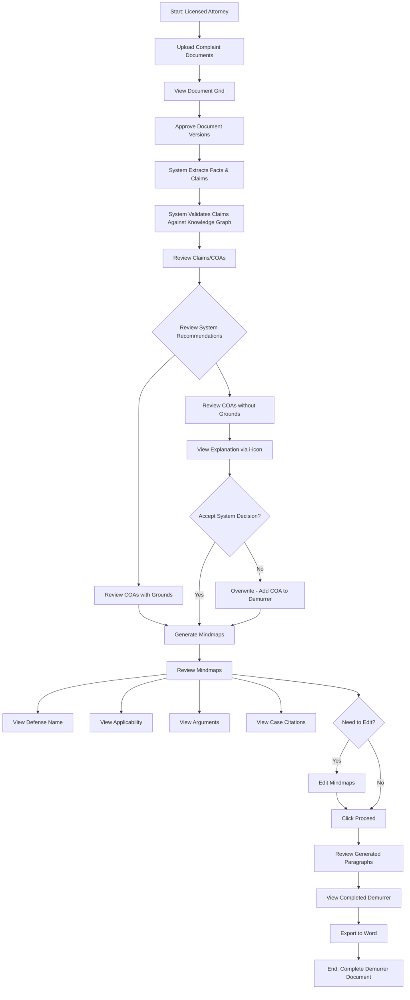

# User Journey: Demurrer App (DR)

## User Profile
**Primary User:** Licensed Research Attorney
**Experience Level:** Professional with legal expertise and training on the app
**Primary Goal:** Efficiently create legally sound demurrer documents based on complaint analysis

## Stage 1: Document Intake & Selection
**User Goal:** Upload and select the correct complaint document(s) for analysis

**User Actions:**
- Navigates to document upload section
- Selects and uploads complaint document(s) in PDF or Word format
- May need to upload multiple versions (original, amended, refiled)

**User Experience:**
- User likely feels task-oriented and focused on getting the right document(s) into the system
- Potential concern about selecting the correct document version

**Potential Pain Points:**
- Uncertainty about which version of a complaint to use if multiple exist
- File format compatibility issues
- Large file upload delays

**Interface Elements:**
- Clear upload button with supported file format information
- Progress indicator during upload
- Confirmation message upon successful upload

## Stage 2: Document Validation & Approval
**User Goal:** Ensure the system is working with the correct document(s)

**User Actions:**
- Views uploaded documents in a document grid display
- Reviews document details to confirm correct versions
- Clicks approve button for each document to proceed

**User Experience:**
- User needs confidence that the correct documents are being processed
- Feels responsible for ensuring accuracy at this foundational stage

**Potential Pain Points:**
- Difficulty distinguishing between similar document versions
- Uncertainty about what "approval" triggers in the system
- No preview capability to verify document contents

**Interface Elements:**
- Document grid showing file names, dates, and version information
- Preview option for quick content verification
- Clear approval buttons with confirmation feedback

## Stage 3: Automated Analysis
**User Goal:** Allow the system to extract and validate claims from the complaint

**User Actions:**
- Initiates analysis (may be automatic after approval)
- Waits while system processes the document

**User Experience:**
- Shift from active to passive role while system works
- Anticipation about results and potential demurrer grounds
- Expectation that the system will accurately identify relevant information

**Potential Pain Points:**
- Lack of visibility into processing status
- Uncertainty about analysis duration
- Concern about accuracy of automated extraction

**Interface Elements:**
- Progress indicator showing analysis stages
- Estimated time remaining
- Cancel option if needed

## Stage 4: Review & Modification of Claims
**User Goal:** Evaluate system-identified claims and make professional judgments about demurrer grounds

**User Actions:**
- Reviews the extracted Causes of Action (COAs)
- Examines system recommendations about grounds for demurrer
- Clicks information icons to understand why certain COAs lack grounds
- Makes professional decisions to overwrite system recommendations when necessary

**User Experience:**
- Engages critical thinking and legal expertise
- Feels empowered when system recommendations align with expectations
- May feel skeptical when system recommendations seem incorrect
- Values transparency in understanding system reasoning

**Potential Pain Points:**
- Disagreement with system's legal analysis
- Insufficient explanation for "no grounds" determinations
- Uncertainty about implications of overwriting system recommendations

**Interface Elements:**
- Clearly organized list with visual differentiation between:
  * COAs with grounds for demurrer (top section)
  * COAs without grounds for demurrer (bottom section)
- Information icons with detailed explanations
- Clear override controls with confirmation prompt

## Stage 5: Mindmap Generation
**User Goal:** Generate structured argument frameworks for each valid demurrer ground

**User Actions:**
- Clicks "Generate Mindmaps" after finalizing COA selections
- Waits for system to create visual and textual representations

**User Experience:**
- Anticipation about how well the system will structure arguments
- Relief at having complex legal reasoning organized visually
- Curiosity about system-identified case precedents

**Potential Pain Points:**
- Uncertainty about what mindmaps will contain
- Concern about completeness of generated content
- Processing delays for complex complaints

**Interface Elements:**
- Generation button with clear labeling
- Progress indicator for mindmap creation
- Preview of mindmap structure

## Stage 6: Mindmap Review & Refinement
**User Goal:** Ensure mindmap content is accurate, comprehensive, and persuasive

**User Actions:**
- Reviews generated mindmaps containing:
  * Affirmative Defense Name
  * Applicability
  * Argument
  * Cases Found
- Toggles between visual mindmap and textual representation
- Edits content to enhance arguments, add additional points, or correct issues

**User Experience:**
- Critical evaluation of system-generated content
- Satisfaction when quality content requires minimal editing
- Professional pride in enhancing arguments with personal expertise
- Relief at having a structured framework to build upon

**Potential Pain Points:**
- Difficulty navigating complex mindmaps
- Limited editing capabilities
- Missing or irrelevant case citations
- Awkward transitions between visual and textual formats

**Interface Elements:**
- Intuitive mindmap visualization with zoom/pan controls
- Toggle between visual and textual representations
- Rich text editing capabilities
- Case citation validation

## Stage 7: Demurrer Generation & Export
**User Goal:** Create the final demurrer document and export it for professional use

**User Actions:**
- Clicks "Proceed" after finalizing mindmap edits
- Reviews generated paragraphs for each COA in separate tabs
- Navigates to matter details page
- Clicks "View Demurrer" to see the complete document
- Exports finished document to Word format

**User Experience:**
- Satisfaction seeing the complete document come together
- Relief at completing a complex legal task more efficiently
- Professional evaluation of final content quality
- Anticipation about how the document will be received

**Potential Pain Points:**
- Navigation between tabs for reviewing multiple COAs
- Limited formatting options in the preview
- Uncertainty about how the exported document will appear
- No ability to make final adjustments before export

**Interface Elements:**
- Clearly labeled tabs for each COA
- Complete document preview
- Export button with format options
- Confirmation of successful export
- Return to matter dashboard option

## Post-Completion
**User Goal:** Return to other tasks with confidence in the generated demurrer

**User Experience:**
- Satisfaction with completed task
- Evaluation of time saved compared to manual drafting
- Mental note of system performance for future reference

**Potential Next Steps:**
- Share document with colleagues for review
- Make final edits in Word
- File the demurrer with the court
- Return to the app for another matter

# User instruction / how to use this app:
>
Welcome to the Demurrer (DR) App! 
Start by uploading and approving the correct versions of your complaint document(s). The system will analyze each cause of action to determine whether that claim has has a **valid grounds** for demurrer. 
For those marked as having grounds, you’ll see recommended arguments and citations; for those without, you can review an explanation of why the system concluded **“no ground”** you can still **override** if needed and generate a demurrer for that claim. 
After finalizing which causes of action to include, generate mindmaps to visualize and refine your arguments. 
Finally, preview the assembled demurrer and export the finished document to Word.
>

# USER FLOW
